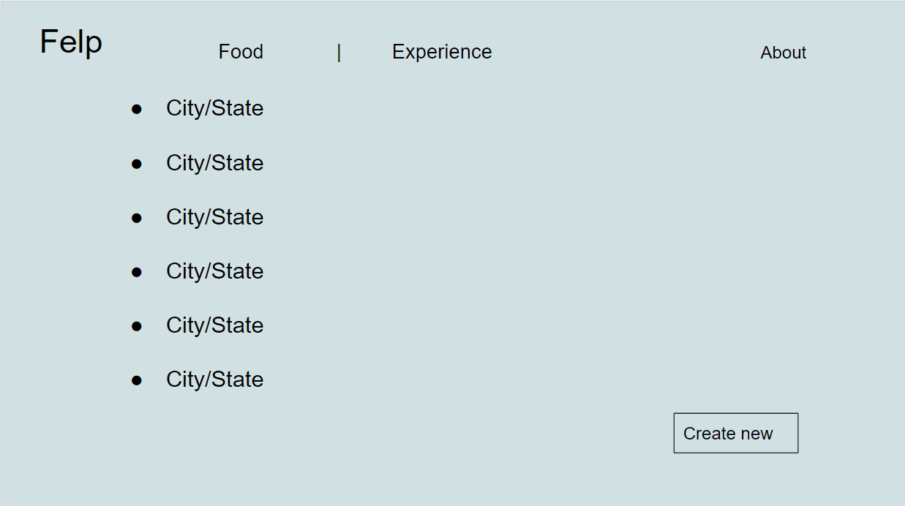
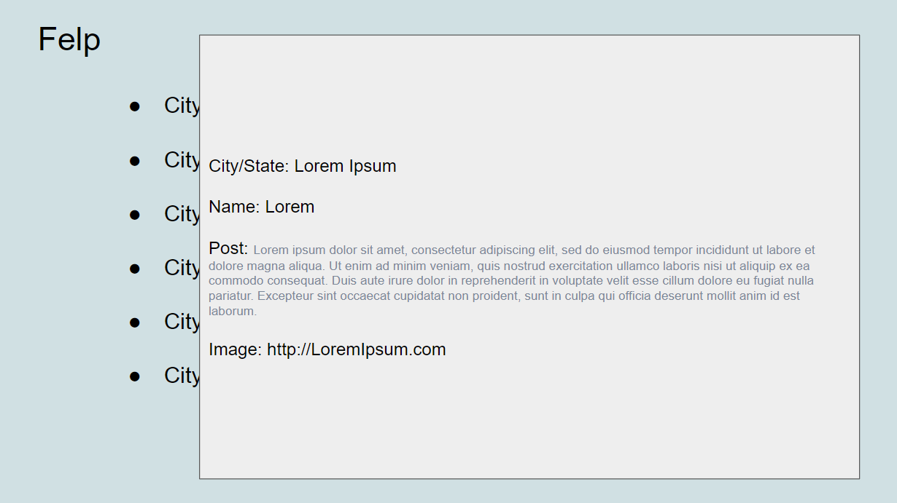
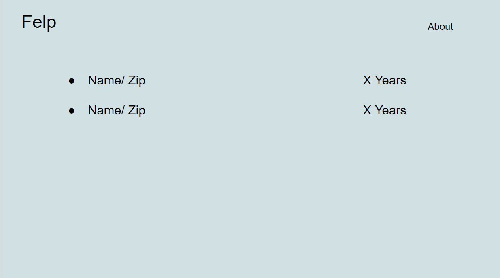
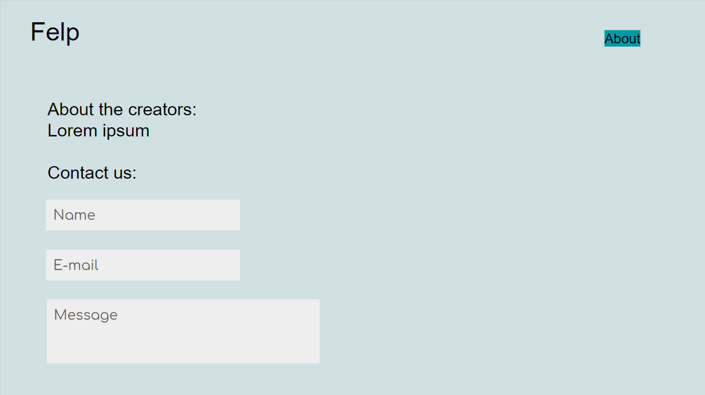

# Felp Frontend

## Application Description
This application is called FELP.  It is a collaboration between a few programmers to create a blog style version of a certain food review site.  The unqiue aspect of our application comes from the idea that the posts are more meaningful in the sense that the user who posts will display their years of residence at a certain location.  Depending on the how long said user lived in the area, anyone can get an idea that the poster will have knowledge of the surrounding environment: places to eat and visit.  The current implementation has a user authentication system that uses a variety of technologies to validate ownership.  For more information on what was used, please visit the link at the end of this section.  This application also has the feature of having a validation requirement to edit and delete posts.  Only the post creator will be able to take such actions.  To be able to post, the user will have to go through our sign up form which will create and save them as a user in our database.  If a user sees on the home page a "You are logged in" message, then the user will be able to contribute to our application.  We hope our enjoy our collaborative effort and happy posting!

### Link to FELP Backend Repository:

https://github.com/team-one-coders/felp-backend

## Technologies Used

- Javascript
- CSS
- HTML
- React
- React Bootstrap
- React Router
- Axios

## Installation

1. Open your terminal and navigate to your desire directory where you want to store this repository using `cd <YOUR DIRECTORY HERE>`
2. On the GitHub repository, click on the "Code" dropdown menu and either click on "HTTPS" or "SSH" depending on what you're using.
3. You can either click the link which will highlight the github or https link and copy it or click on the icon next to the link which will copy it into your clipboard.
4. fork and clone this repository to your machine using `git clone <PASTE SSH OR HTTPS HERE>`
5. `cd` into the newly created directory
6. run `npm i` or `npm install` to install dependencies
7. open in VScode using `code .`
8. to run the frontend locally, run `npm start`

If you're having difficulties in the installation process, visit this link for more information:

https://docs.github.com/en/repositories/creating-and-managing-repositories/cloning-a-repository

If you would just like to visit the application, please click on this link:

https://felp-beta.netlify.app/

## Current Application State

# Contribution Guidelines

## How to Identify Bugs

> If you identify bugs, submit an issue on the Git repo. Please detail the bug in your issue. If you know how to fix it, feel free to note the methods you would use. You could also submit a pull request with suggested code to fix it.

# Initial Planning

## Description

Felp (name in progress) is an app that allows you to leave food reviews based off locations. The location will be based off City/State, and include an image along with a description

## User Stories

- As a user, I want to use this App, so I can learn more about experiences in a particular location
- As a user, I want to click on a city/state, so I can see the list of food reviews in my area
- As a user, I want to click on a post to see a description of the review, so I can pick a good place to go to eat
- As a user, I want to scroll or look through the different posts, so I can see different options
- As a user, I want to click "Create new", so I can create a review of a new Food
- As a user, I want to delete/edit, so I can show the most relevant review
- As a user, I want to click on the navigation bar (About), to learn about the developers and contact information
- As a user, I want to view the Name/Zip Code and "x years", to see how much experience they had in a particular location

Stretch:
- As a user, I want to switch between the experience and food tab, so I can learn about different experiences
- As a user, I want to look through the map, so I can learn more about experiences in a particular location

### Wireframes

