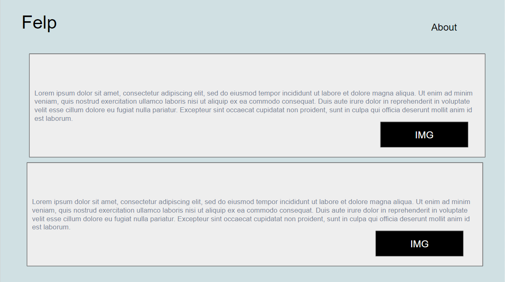

# Felp Frontend

## Description

Felp (name in progress) is an app that allows you to leave food reviews based off locations. The location will be based off City/State, and include an image along with a description

## User Stories

- As a user, I want to use this App, so I can learn more about experiences in a particular location
- As a user, I want to click on a city/state, so I can see the list of food reviews in my area
- As a user, I want to click on a post to see a description of the review, so I can pick a good place to go to eat
- As a user, I want to scroll or look through the different posts, so I can see different options
- As a user, I want to click "Create new", so I can create a review of a new Food
- As a user, I want to delete/edit, so I can show the most relevant review
- As a user, I want to click on the navigation bar (About), to learn about the developers and contact information
- As a user, I want to view the Name/Zip Code and "x years", to see how much experience they had in a particular location

Stretch:
- As a user, I want to switch between the experience and food tab, so I can learn about different experiences
- As a user, I want to look through the map, so I can learn more about experiences in a particular location

### Wireframes

